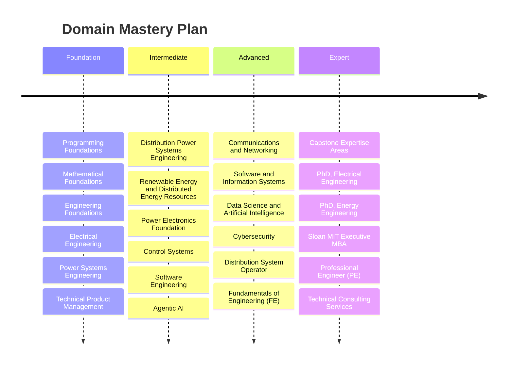

# Learning in Public

This is my open notebook. Every concept I study, every problem I solve, every credential I pursue is documented here as I go.

The goal is to pursue mastery, visibly, one note at a time.

---

## How to Navigate

Notes are organized by domain. Use the graph view to discover connections across topics. Tags filter by content type and status.

- `#status/seedling` — early, rough, in progress
- `#status/growing` — active and developing
- `#status/evergreen` — complete and stable

---

## Domains

  

### [[00-foundations/_index|Foundations]]
Fundamental knowledge from first principles.

#### [[00-foundations/programming/_index|Programming Foundations]]

Core programming knowledge: data structures, algorithms, systems thinking, and software design principles.

#### [[00-foundations/mathematics/_index|Mathematical Foundations]]

The mathematical language underlying engineering: calculus, linear algebra, differential equations, probability, and discrete math.

#### [[00-foundations/engineering/_index|Engineering Foundations]]

Fundamental engineering principles: circuits, thermodynamics, mechanics, and systems analysis.

---

### [[01-electrical-engineering/_index|Electrical Engineering]]

The core discipline. Power, control, signals, communications, and electronics.

- [[01-electrical-engineering/power-systems/_index|Power Systems Engineering]]  
- [[01-electrical-engineering/power-systems/distribution/_index|Distribution Power Systems]]  
- [[01-electrical-engineering/renewable-energy-der/_index|Renewable Energy & DER]] 
- [[01-electrical-engineering/power-electronics/_index|Power Electronics]]  
- [[01-electrical-engineering/control-systems/_index|Control Systems]]  
- [[01-electrical-engineering/communications-networking/_index|Communications & Networking]]  

---

### [[02-software-systems/_index|Software & Information Systems]]

Software engineering, AI, data science, and cybersecurity.

- [[02-software-systems/software-engineering/_index|Software Engineering]]  
- [[02-software-systems/information-systems/_index|Information Systems]]  
- [[02-software-systems/data-science-ai/_index|Data Science & AI]] 
- [[02-software-systems/agentic-ai/_index|Agentic AI]] 
- [[02-software-systems/cybersecurity/_index|Cybersecurity]]  

---

### [[03-domain-expertise/. _index|Domain Expertise]]

Applied knowledge at the intersection of engineering, operations, and strategy.

- [[03-domain-expertise/distribution-system-operator/_index|Distribution System Operator]]  
- [[03-domain-expertise/technical-product-management/_index|Technical Product Management]]  
- [[05-consulting/_index|Technical Consulting]]

---

### [[04-credentials/_index|Credentials]]

Formal learning paths, exam preparation, and degree programs in progress.

- [[04-credentials/fe-exam/_index|FE Exam]]
- [[04-credentials/pe-exam/_index|PE Exam]]
- [[04-credentials/mit-sloan-mba/_index|MIT Sloan Executive MBA]]
- [[04-credentials/phd-electrical-engineering/_index|PhD — Electrical Engineering]]
- [[04-credentials/phd-energy-engineering/_index|PhD — Energy Engineering]]